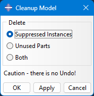

# Abaqus_Plugin_Cleanup_Model
Simple Abaqus Plugin to delete suppressed instances and/or unused parts from current model

The Plugin allows to delete all suppressed in one action. And you can also delete all parts, that do not have an instance in the assembly.

Be careful - there is no Undo for this.
You can only close Abaqus/CAE without saving and reopen the last saved state to undo the operation.

